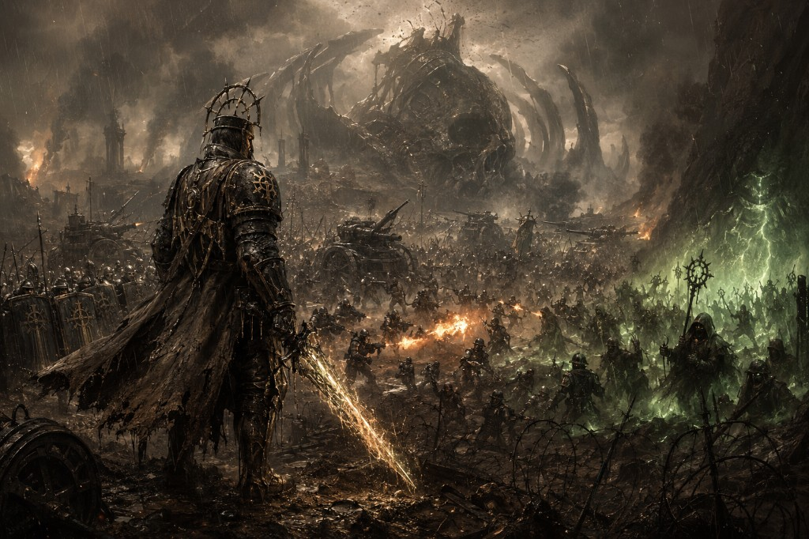

# Cenithael RPG

RPG de texto con IA en un universo de guerra perpetua. Proyecto del curso [Building an AI-Powered Game](https://www.deeplearning.ai/courses/building-an-ai-powered-game) de DeepLearning.AI y Together AI.



  

## Características

- **Universo Cenithael** — tres facciones en guerra perpetua sobre titanos caídos
- **Tres modos de inicio** — héroe del mundo, forjar personaje, generar campaña nueva
- **Pueblo aleatorio** al elegir héroe predefinido
- **Maestro de Juego con opciones numeradas** — escribe `1`, `2`… o acciones libres
- **Tiradas d20 reales** con CD, críticos y modificadores por atributo
- **Combate con PV** — enemigos, daño determinista, caída en combate
- **Inventario** — detección JSON; solo cambia con transacciones cerradas
- **Comercio contextual** cuando la historia lo permite
- **Moderación** con Llama Guard (entrada y salida)
- **Guardado automático** en `saves/partida.json`
- **Continuar aventura** o **Comenzar de 0**

## Requisitos

- Python 3.11 o superior
- Cuenta en [Together AI](https://www.together.ai/) con API key
- Conexión a internet (llamadas a Llama 3.3 y Llama Guard)

## Instalación

### Windows

```powershell
git clone <url-del-repositorio>
cd cenithael-rpg
python -m venv .venv
.venv\Scripts\activate
pip install -r requirements.txt
copy .env.example .env
# Edita .env y pega tu TOGETHER_API_KEY
python app.py
```

### macOS / Linux

```bash
git clone <url-del-repositorio>
cd cenithael-rpg
python3 -m venv .venv
source .venv/bin/activate
pip install -r requirements.txt
cp .env.example .env
# Edita .env y pega tu TOGETHER_API_KEY
python app.py
```

Abre el enlace local que muestra Gradio (por defecto `http://127.0.0.1:7860`).

### Enlace público (opcional)

```bash
python app.py --share
```

## Cómo jugar

1. **Si tienes partida guardada:** elige *Continuar aventura* o *Comenzar de 0*.
2. **Nueva partida** — una de tres pestañas:
   - **Héroe del mundo:** elige un personaje; el frente se asigna al azar.
   - **Forjar personaje:** nombre, arquetipo, motivación y cicatriz; la IA crea tu ficha.
   - **Nueva campaña:** genera un mundo nuevo vía API (~2 min).
3. Pulsa **Comenzar aventura** (o **Forjar y comenzar**).
4. En el chat escribe **`iniciar juego`**.
5. Lee las opciones numeradas y responde con un número o describe tu acción.
6. Observa tiradas 🎲, combate ⚔️, misiones 📜 e inventario en el panel lateral.

### Comercio

Cuando veas 🏪, escribe explícitamente qué compras o vendes, por ejemplo:

```
Compro una antorcha por 2 monedas de sacramento
```

### Combate

Elige opciones etiquetadas `[Combate]` o ataca cuando haya un enemigo activo. Si tus PV llegan a 0, usa **Comenzar de 0**.

## Guardar y continuar

| Acción | Descripción |
|--------|-------------|
| Auto-guardado | Tras cada turno en `saves/partida.json` |
| Guardar partida | Botón manual en la interfaz |
| Continuar aventura | Restaura estado, inventario, PV e historial del chat |
| Comenzar de 0 | Borra el save y vuelve al menú inicial |

Los archivos en `saves/` no se suben a git (están en `.gitignore`).

## Generar mundo nuevo (CLI)

```bash
python scripts/generate_world.py
```

Guarda el resultado en `data/cenithael_custom.json`. Luego usa **Nueva campaña** en la UI o selecciona héroes de ese archivo.

## Estructura del proyecto

```
cenithael-rpg/
├── app.py                 # python app.py [--share]
├── assets/
│   └── cover.png          # Portada del juego
├── game/
│   ├── engine.py          # Dados, PV, combate
│   ├── gm.py              # Maestro de Juego (turnos, eventos)
│   ├── world.py           # Carga de mundo y partidas
│   ├── world_gen.py       # Generación procedural
│   ├── character.py       # Forjar personaje
│   ├── inventory.py       # Inventario JSON
│   ├── safety.py          # Llama Guard
│   ├── save.py            # Persistencia
│   └── ui.py              # Interfaz Gradio
├── data/
│   └── cenithael_default.json
├── saves/                 # Partidas del jugador (local)
└── scripts/
    ├── build_default_world.py
    └── generate_world.py
```

## Stack

| Componente | Uso |
|----------|-----|
| [Together AI](https://www.together.ai/) | Llama 3.3 70B (narrativa) + Llama Guard 4 (seguridad) |
| [Gradio](https://gradio.app/) | Interfaz de chat |
| JSON | Mundo, inventario, partidas guardadas |

## Créditos

- Curso **Building an AI-Powered Game** — [DeepLearning.AI](https://www.deeplearning.ai/courses/building-an-ai-powered-game) con Together AI y AI Dungeon
- Inspiración de mecánicas: motores deterministas + LLM narrador ([Project Infinity](https://github.com/electronistu/Project_Infinity), [Daicer](https://github.com/lguibr/daicer))

## Licencia

Proyecto educativo. El universo **Cenithael** es original; no está afiliado a Games Workshop ni Trench Crusade.
